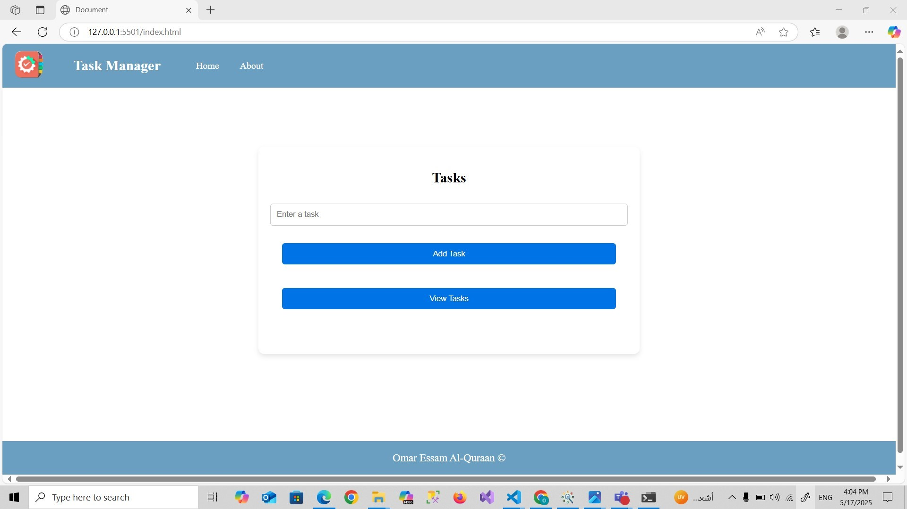
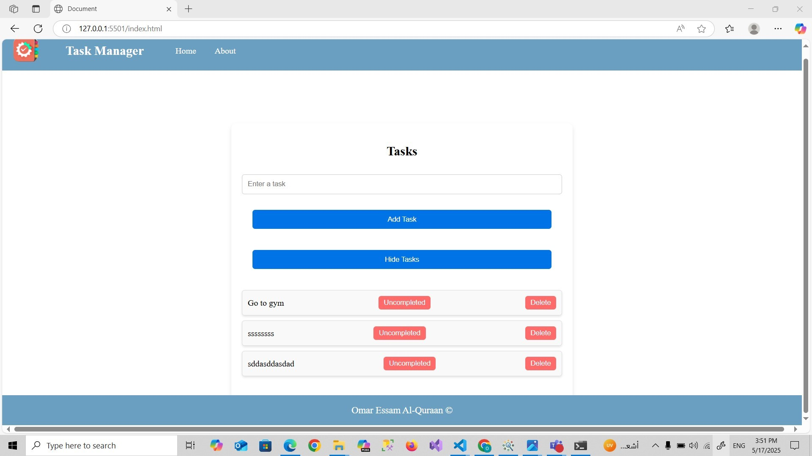
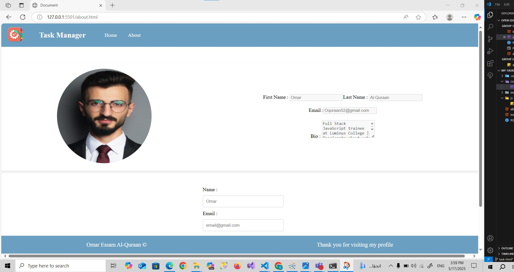

# My-Tasks

## Pages : 

### Home Page  

>**Home Page:** A header, task input section, task table/list, and footer.

###  About Page 

>**About Page:** A header, your personal section, a contact form, and a footer.

>What observations or questions do you have about what you've learned so far?
>I have is that I should review the basics of HTML, CSS, and JavaScript to strengthen my foundation — especially concepts like Flexbox, Grid, and positioning.

> How long did it take you to complete this assignment? And how long did you expect it to take?
>It took me around four hours to complete this assignment. If I had enough knowledge and experience, it would have taken me less time.

## Web Pages  : 

### Home Page  

>**Home Page:** A header, task input section, task table/list, and footer.

###  About Page 

>**About Page:** A header, your personal section, a contact form, and a footer.
